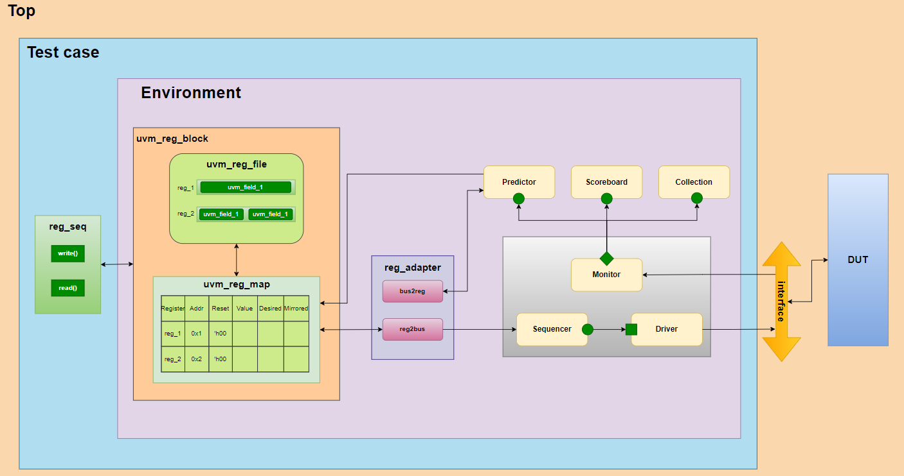

# I2C Verification - UVM RAL

## UVM's BLOCK DIAGRAM
```
This repo contains a example of the use of the UVM RAL to verify I2C module with APB interface
```


-   [RTL Source](https://github.com/oggrr3/i2c_code)